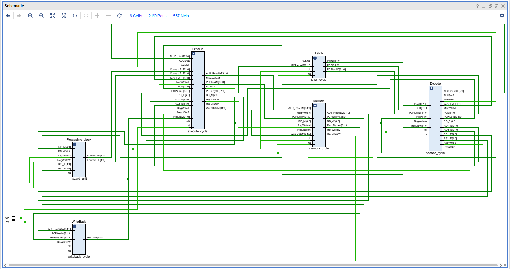
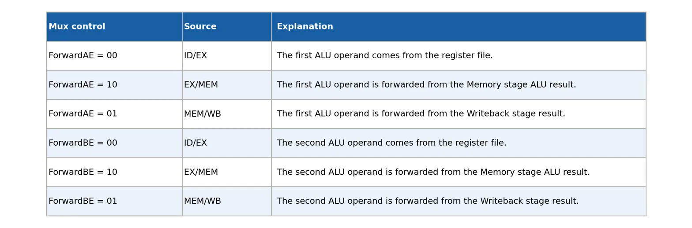
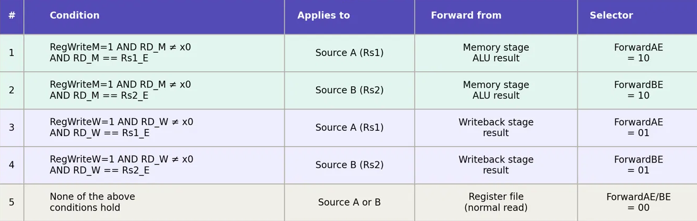
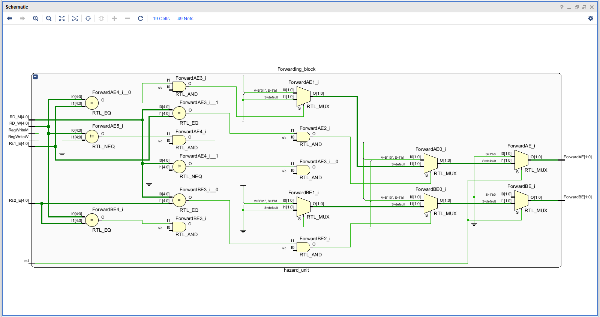
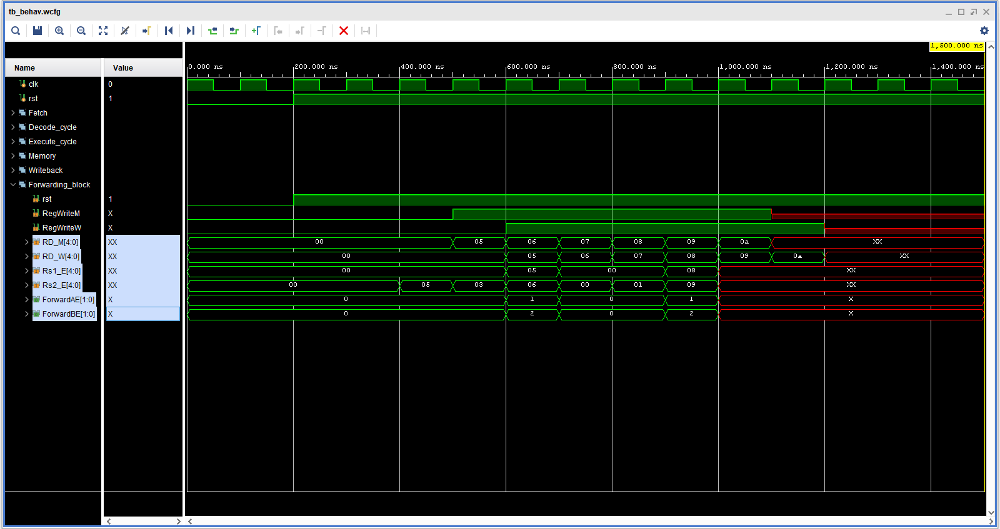
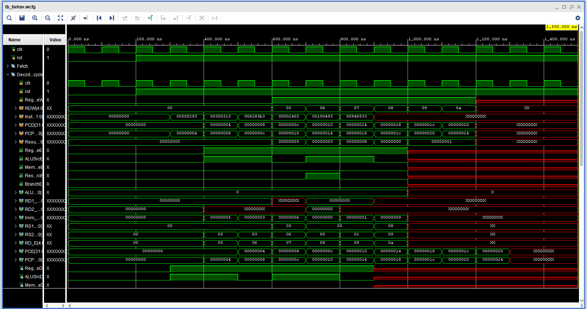

# RISC-V-32I-5-Stage-Pipeline-Core
** 5-stage pipeline implementation of RISC-V 32I Processor.**

In this repository, I have implemented a 5-stage pipelined processor, which is actually the conversion of my previous single-cycle implementation of the processor into a pipeline.
Link to the previous single-cycle implementation is given as: https://github.com/Sisiram01/Single-Cycle-RISC-processor.git.

In a pipelined implementation, we divide our instruction into multiple stages, and in the case of a 5-stage pipelined implementation, we will, of course, divide the instruction into 5 different stages. Those stages being:
- Instruction Fetch
- Instruction Decode
- Instruction Execution
- Memory Read/Write
- Write Back

This pipelined implementation of the processor supports six basic instructions:
- R-Type
- I-Type
- S-Type
- B-Type
- J-Type
- U-Type

This RISC-V 5 Stage pipeline Implementation does encounter hazards, and it has been surpassed by implementing a hazard unit to handle all types of hazards(structural and data hazards).

# Implementation and Procedure

5 Stage pipeline requires a series of registers between the complete datapath; these registers will be responsible for tracking instructions or different parts of instructions required by different modules. The instructions need to be propagated into all five stages for them to be executed correctly, and with the help of these registers, the corresponding instructions propagate or different parts of instructions accordingly. The datapath followed is mentioned below and is the extended version of the same implemented single-cycle datapath as tagged above.



# Discussions

**1. Fetch Cycle Datapath**

The Fetch cycle is the first stage of the instruction execution process. The main goal of the fetch cycle is to retrieve the next instruction from memory so that it can be decoded and executed by the processor.

**2. Decode Cycle Datapath**

The decode cycle is the second stage of instruction execution. The main objective of this stage is to interpret the fetched instruction and prepare the necessary inputs (registers, control signals) for subsequent stages.

**3. Execution Cycle Datapath**

The Execution cycle is the third stage of the instruction execution process. Its main role is to perform the arithmetic or logical operation dictated by the instruction, calculate memory addresses for load/store operations, or determine the outcome of a branch.

**4. Memory Read/Write Cycle Datapath**

The Memory Read or Write Cycle is the fourth stage of the instruction execution process. This stage is responsible for interacting with data memory during load or store instructions. If the instruction is not a memory operation, this stage is skipped, and the processor moves to the writeback stage.

**5. Write Back Cycle Datapath**

The Writeback cycle is the fifth and final stage of the instruction execution process. The main purpose of this stage is to write the result of an instruction (whether it be from an arithmetic operation or a memory load) back to the destination register.

**Note: Hazard Unit**

**Hazard units** in a pipeline processor are responsible for detecting and resolving hazards that can occur when executing instructions in a pipelined architecture.
**Hazards** can cause incorrect program execution or reduce performance by stalling the pipeline.
There are three primary types of hazards: **data hazards, control hazards, and structural hazards**.
In a 32-bit RISC-V 5-stage pipeline, **hazard detection and forwarding units** are critical components that help manage these hazards.

**Structural Hazard**
1. Hardware does not support the execution of instructions in the same clock cycle.
2. Without having two memories, a RISC-V pipelining architecture will have a structural hazard.

**Data Hazard**
1. Data to be executed is not available.
2. May occur when the pipeline is stalled.
3. Solve by using forwarding or bypassing technique.

**Solution to Data Hazard.**
1. Solving Data Hazards with nops
2. Solving Data Hazard with Forwarding / Bypassing

The Data Hazard is solved using Forwarding/ Bypassing

**Condition Table:**


**Condition for Data Hazard:**



**Hazard Architecture:**



**Hazard Unit Waveform Explanation**



**Note: The selected registers represent the hazard unit**

# Simulation Results and Tools Used

The simulation has been run entirely in **Vivado**, using the bundled **xsim behavioral simulator** — no FPGA board, synthesis, or bitstream generation involved anywhere in this flow.

**The input machine codes are provided in `sim/mem/memfile.hex`.**

**Pipeline Simulation Waveform:**



**Note:** Vivado (any edition, including the free WebPACK license) is required — only the bundled `xsim` simulator is used. Download from: https://www.xilinx.com/support/download.html.

**Setup:**

From the project's Tcl Console:
```tcl
cd /path/to/RISCV32I_5stage_Vivado
source scripts/create_and_sim.tcl
```

This creates the project, adds all RTL and simulation sources, and launches a behavioral simulation with the waveform viewer.

**Command-line only (no GUI), with Vivado's `bin` on PATH:**
```bash
cd RISCV32I_5stage_Vivado
bash scripts/run_sim.sh
```
